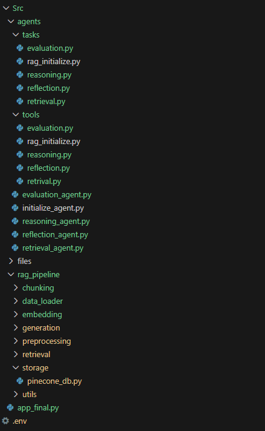
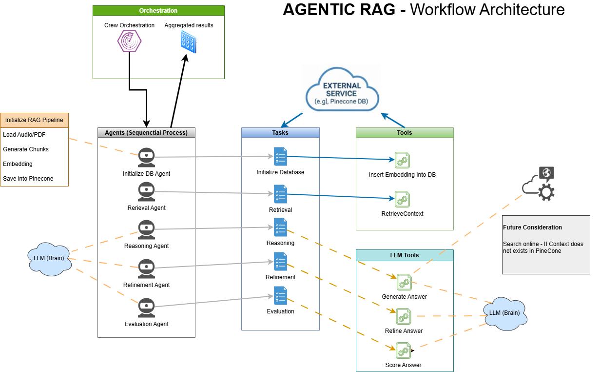

#  Multi-Agent RAG Pipeline (CrewAI)

This project implements a sophisticated **Retrieval-Augmented Generation (RAG)** pipeline using the **CrewAI** framework. It leverages a team of specialized AI agents (Retrieval, Reasoning, Reflection, and Evaluation) to process user queries, retrieve relevant context from a vector store (**Pinecone**), generate grounded answers, refine those answers, and finally, evaluate the quality of the output.

##  Features

* **Multi-Agent Workflow:** A structured, sequential pipeline with agents dedicated to retrieval, reasoning, refinement, and evaluation.
* **Data Ingestion:** Supports loading and processing both **PDF documents** and **audio transcripts** via `PyPDFLoader` and **Whisper** (simulated in provided code).
* **Embedding Model:** Uses the **HuggingFace** model `all-MiniLM-L6-v2` for generating embeddings.
* **Vector Store Integration:** Uses **Pinecone** for efficient storage and retrieval of embeddings.
* **Grounded Generation:** A **Reasoning Agent** uses a strict, custom LLM prompt to generate an answer *strictly* based on the retrieved context.
* **Self-Correction & Refinement:** A **Reflection Agent** refines the generated answer for structure, clarity, and conciseness.
* **Quality Assurance:** An **Evaluation Agent** provides a final scoring report (Accuracy, Relevance, Clarity) using an LLM-as-a-judge approach.
* **LLM:** Configured to use **Google Gemini 2.0 Flash** for CrewAI tasks and **OpenAI/GPT** for custom generation/refinement/scoring functions (Note: This mixed LLM setup uses Gemini for orchestration and OpenAI for specific custom tools).
* **Interactive CLI:** The entry point (`app_final.py`) provides an interactive command-line interface for database initialization and querying.
* **Robust Logging:** Uses a custom `logger.py` to track workflow and suppress verbose external library logs.

## Project Structure

The project is highly modular, separating concerns into dedicated directories:

 

##  Getting Started

### Prerequisites

* Python 3.x
* Access to the **Gemini API** (for CrewAI orchestration).
* Access to the **OpenAI API** (for custom generation/scoring tools).
* Access to **Pinecone** (API key, environment, and index name configured).
* The necessary environment variables (`PDF`, `AUDIO`, `OPENAI_KEY`, `EMBEDDING_MODEL_NAME`, etc.) must be set in a `.env` file.

### Setup and Environment

1.  **Clone the repository.**
2.  **Install dependencies:**
    ```bash
    pip install crewai pydantic pinecone-client langchain-huggingface python-dotenv openai whisper
    ```
3.  **Configure `.env` file:**
    Ensure required keys and paths are set:
    ```ini
    # Example .env content
    APINECONE_API_KEY="..."
    INDEX_NAME="..."
    EMBEDDING_MODEL_NAME="all-MiniLM-L6-v2"
    OPENAI_KEY="..."
    OPENAI_MODEL="gpt-4-turbo"
    PDF="./path/to/Rag.pdf"
    AUDIO="./path/to/Rag.mp3"
    ```

### Running the Pipeline

1.  **Start the application:**
    ```bash
    python app_final.py
    ```

2.  **Select Choice [1] (Pinecone - Cloud Setup):**
    * This will first run a dedicated crew to execute the **Insertion/Embedding** task in `pinecone_db.py` (though the embedding logic is currently commented out, this is the intended setup step).
    * It will then drop into the interactive query loop.

3.  **Interactive Query Loop:**
    * Enter your query. The full 4-agent RAG crew is executed: **Retrieve** (from Pinecone) $\rightarrow$ **Reason** (Generate Answer) $\rightarrow$ **Reflect** (Refine Answer) $\rightarrow$ **Evaluate** (Score Report).

##  Key Components

The system is built around three primary components:

1. **Agents**:
   - Specialized entities responsible for handling specific aspects of the pipeline.
   - Sequential processes that collaborate to achieve the overall goal.
   - Examples include initialization, retrieval, reasoning, refinement, and scoring agents.

2. **Tasks**:
   - Defined operations that agents execute to process data and achieve objectives.
   - Tasks are modular and designed to ensure scalability and maintainability.
   - Examples include context retrieval, answer generation, and quality evaluation.

3. **Tools**:
   - External services or utilities that agents use to perform their tasks.
   - Examples include vector databases like Pinecone, embedding models, and APIs.
   - Tools are integrated seamlessly into the pipeline to enhance functionality and reliability.

### 1. Data Handling (`rag_pipeline/preprocessing`)
* **PDF/Audio Processing:** Extracts text from PDF files using `PyPDFLoader` and transcribes audio files using the `whisper` model.
* **Chunking:** Uses `RecursiveCharacterTextSplitter` for chunking text with overlapping segments to maintain context.

### 2. Retrieval and Embedding (`rag_pipeline/embedding`, `rag_pipeline/storage`)
* **Embedding Model:** `HuggingFaceEmbeddings(model_name="all-MiniLM-L6-v2")` is the standard for both query and document embedding.
* **Pinecone (`pinecone_db.py`):** Handles initialization, connection, and the vector search query (`fetch_pinecone_context`), retrieving the top 3 matches for the RAG agents.

### 3. Generation and Quality (`rag_pipeline/generation/answer_generation.py`)
This file defines the strict LLM prompts that govern the quality of the output:
* **`build_strict_prompt`:** Used by the **Reasoning Agent** to ensure the answer is **strictly grounded** in the retrieved context. If context is insufficient, the required response is **"Not found in context."**
* **`refine_answer`:** Used by the **Reflection Agent** to improve clarity, structure, and conciseness without adding new facts.
* **`score_answer`:** Used by the **Evaluation Agent** as the final check, implementing the LLM-as-a-judge pattern to score the answer against the criteria: **Accuracy**, **Relevance**, and **Clarity**.

## Project Architecture

This capstone project extends my earlier work in RAG-based chatbot application by developing a fully agentic AI system capable of autonomous reasoning, tool execution, and self-reflection. The objective is to build an intelligent workflow where the agent not only retrieves and processes information using a well-structured RAG pipeline, but also evaluates its own decisions, corrects errors, and performs meaningful actions through tool-calling.

The system follows a complete pipeline—data preparation, contextualization, retrieval design, multi-step reasoning, reflection, and evaluation. 

This project showcases how modern agentic systems can integrate data, reasoning, and action into a cohesive and reliable solution.

This document outlines the architecture and sequential data flow of the Interactive Agent Crew, which is responsible for processing a user query, retrieving context from Pinecone, generating a refined answer, and providing a final quality evaluation.

CrewAI transforms a complex RAG pipeline into a collaborative team of specialized agents, each handling one aspect (Initialization, retrieval, reasoning, refinement, scoring) with built-in orchestration, error handling, and production features.

### Architecture Diagram

Below is the architecture diagram illustrating the sequential data flow and agentic system:



## Environment Variables

The project relies on a `.env` file to configure API keys, model names, and file paths. Below is an example of the `.env` file:

```ini
OPENAI_API_KEY=Add-your-key-here
OPENAI_KEY=Add-your-key-here
OPENAI_API_MODEL=Add-your-model-here

HUGGINGFACEHUB_API_TOKEN=Add-your-token-here
EMBEDDINGS_HUGGINGFACE_URL=Add-your-url-here

MODEL_NAME=Add-your-model-here
MODEL=Add-your-model-here

PDF=Src/files/rag.pdf
AUDIO=Src/files/rag.mp3

# --- RAG Setup Constants ---
COLLECTION_NAME=rag_data_collection
EMBEDDING_MODEL_NAME=all-MiniLM-L6-v2

# --- PINECONE Setup Constants ---
INDEX_NAME=rag-index
PINECONE_API_KEY=Add-your-key-here
CREWAI_TRACING_ENABLED=true
GEMINI_API_KEY=Add-your-key-here
```

Ensure you replace placeholder values (e.g., `Add-your-key-here`) with actual API keys and paths before running the project.
